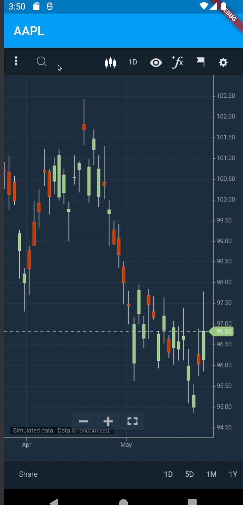

# ChartIQ Flutter POC

This rough proof-of-concept demonstrates using a WebView with Flutter to render a ChartIQ chart. It is not definitive or prescriptive—simply an example.

There are two branches in this repository which outline two different approaches:
* [main](https://github.com/cosaic-poc/ChartIQ-Flutter-POC/tree/main) demonstrates using local assets to display a chart on the device. This may not be the best approach, as it would require a redeploymet of the mobile apps every time the ChartIQ library needs to be updated, which is at least yearly.
* [remote](https://github.com/cosaic-poc/ChartIQ-Flutter-POC/tree/remote) uses a WebView to pull from a remote web location. It also shows communication between Flutter and the page's JavaScript

# Setup


## Main

1. Include a build of ChartIQ in `assets/chartiq`. It will likely be best to use the output of a Webpacked build to simplify the process.
1. Add `webview_flutter_plus` as a dependency in `pubspec.yaml`:

    ```yaml
    dependencies:
      webview_flutter_plus: ^0.2.3+1P
    ```
1. Allow access to `assets` in `pubspec.yaml`:

    ```yaml
     assets:
        - assets/chartiq/js/
        - assets/chartiq/js/thirdparty/
        - assets/chartiq/css/
        - assets/chartiq/css/img/
        - assets/chartiq/
    ```

1. Include the webview in the `.dart` file:

    ```js
    body: Center(
        child: WebViewPlus(
          javascriptMode: JavascriptMode.unrestricted,
          onWebViewCreated: (controller) {
            controller.loadUrl('assets/chartiq/index.html');
          },
        ),
      ),
    ```

### Run

1. Open a simulator.
1. `flutter run`

### Expected Outcome


## Remote

1. Create a build of ChartIQ on a remote server. If desired, include the following JavaScript to demonstrate chart-to-dart communication:

    ```js
      stxx.addEventListener('newChart', () => {
        messageHandler.postMessage(stxx.chart.symbol);
      });
    ```
1. Include the URL in `lib/main.dart`.
1. Review the JavaScript channel in `main.dart`.


### Run

1. Open a simulator.
1. `flutter run`

### Expected Outcome

