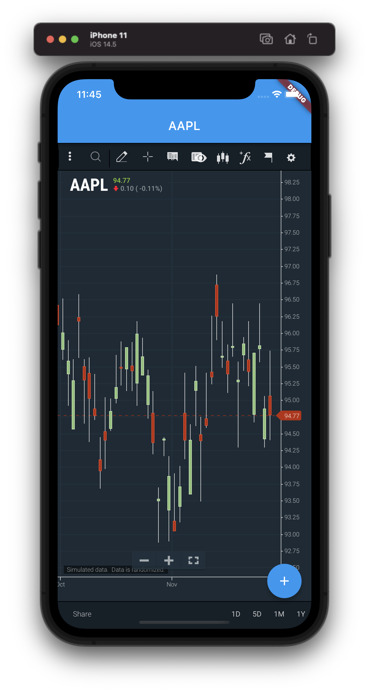

# chartiq_flutter_poc

This rough proof-of-concept demonstrates using a WebView with Flutter to render a ChartIQ chart. It is not definitive or prescriptive—simply an example.

# Setup

1. Include a build of ChartIQ in `assets/chartiq`. It will likely be best to use the output of a Webpacked build to simplify the process.
1. Add `webview_flutter_plus` as a dependency in `pubspec.yaml`:

    ```yaml
    dependencies:
      webview_flutter_plus: ^0.2.3+1P
    ```
1. Allow access to `assets` in `pubspec.yaml`:

    ```yaml
     assets:
        - assets/chartiq/js/
        - assets/chartiq/js/thirdparty/
        - assets/chartiq/css/
        - assets/chartiq/css/img/
        - assets/chartiq/
    ```

1. Include the webview in the .dart file:

    ```js
    body: Center(
        child: WebViewPlus(
          javascriptMode: JavascriptMode.unrestricted,
          onWebViewCreated: (controller) {
            controller.loadUrl('assets/chartiq/index.html');
          },
        ),
      ),
    ```

# Expected Outcome



